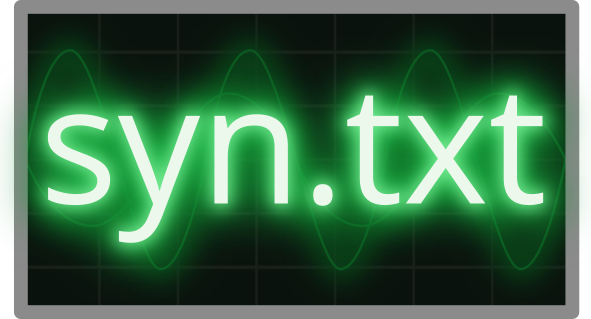

<h1 align="center">
  <a href="https://github.com/fatho/syn-txt"></a>
</h1>

<p align="center">
  <a href="https://github.com/fatho/syn-txt/actions?query=branch%3Amaster"></a>
</p>

The goal is for this to be a declarative, text-based synthesizer/audio workstation.
At the moment, it is very much work in progress. See the [roadmap](/planning/roadmap.md)
for a rough outline of what is planned for the near future.

However, there is already a working prototype that includes
- a simple textual format for writing melodies
- a small embedded DSL for constructing simple songs
- a synthesizer with multiple oscillators, several waveforms, and simple filters
- a convenient function providing the main function for an executable generating the song (see [`examples/demo.rs`](examples/demo.rs))

Eventually, the idea is that song descriptions get a serialization format,
making it possible to generate them from other programming languages as well.

## Building

The project is written in [rust](https://www.rust-lang.org/) and all tooling is pulled in via [nix](https://nixos.org/nix/).

**With Nix**

There is a [`shell.nix`](shell.nix) file declaring all necessary dependencies.
Simply run `nix-shell` in the repository root to drop into a shell where all dependencies are avaiable.
Then, the normal [`cargo`](https://doc.rust-lang.org/cargo/) workflow applies.

**Without Nix**

Ensure that you have a working install of
- `rustc` version 1.43 (although other versions might also work) and `cargo` (e.g. using [rustup](https://rustup.rs/))
- `sox`

## Demo

Currently, one example song is included and expanded when new features are added to the core.
It is written using the Rust EDSL:

```bash
# Play the included example melody
cargo run --example demo
```

Sound is generated by spawning a [sox][sox] subprocess and piping the audio data to it.
If everything worked, it should produce something similar to [this audio snippet](doc/source/_static/demo.ogg).

## License

The project is free software licensed under the [GNU General Public License Version 3](/LICENSE).

[sox]: http://sox.sourceforge.net/